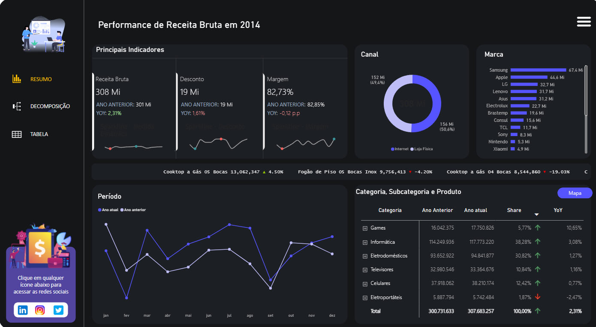
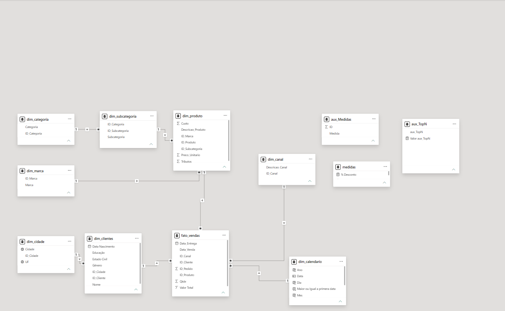

# 📊 Dashboard Executivo de Business Intelligence | Power BI

Projeto de Business Intelligence desenvolvido em **Power BI** para análise de indicadores de desempenho e acompanhamento de resultados de negócio.

O dashboard transforma dados operacionais em informações visuais e interativas, permitindo analisar métricas, comparar períodos e explorar os resultados por diferentes dimensões do negócio.

---

## 🎯 Objetivo do Projeto

O objetivo deste projeto é construir uma solução analítica capaz de facilitar o acompanhamento dos principais indicadores de desempenho por meio de uma interface centralizada e interativa.

O relatório permite analisar diferentes perspectivas dos dados, identificar variações entre períodos e aprofundar a análise por meio de filtros, páginas de detalhamento e tooltips personalizados.

---

## 🖥️ Dashboard

<p align="center">
  
</p>

> A imagem acima apresenta a visão executiva do relatório. Outras páginas do projeto permitem análises mais detalhadas dos dados.

---

## 📌 Principais Indicadores

O dashboard acompanha diferentes métricas de negócio, incluindo:

- 💰 Faturamento
- 💵 Receita
- 📈 Margem
- 🏷️ Desconto
- 🛒 Ticket Médio
- 📦 Quantidade de Pedidos
- 📊 PMV
- 📅 Comparação entre Ano Atual e Ano Anterior

Além dos indicadores principais, o relatório permite analisar a evolução dos resultados e sua distribuição por diferentes dimensões.

---

## 🧱 Modelagem de Dados

O modelo foi estruturado utilizando o conceito de **Star Schema (Modelo Estrela)**, separando os dados entre tabelas fato e dimensões.

Essa abordagem facilita a criação das medidas, o relacionamento entre as informações e a aplicação dos filtros utilizados nos relatórios.

Também foi utilizada uma dimensão de calendário para suportar cálculos relacionados a períodos e comparações temporais.

<p align="center">
  
</p>

---

## 🧮 DAX e Inteligência de Tempo

O projeto utiliza **DAX (Data Analysis Expressions)** para criação de indicadores, comparações entre períodos e medidas dinâmicas.

Entre os conceitos aplicados estão:

- `CALCULATE`
- `DIVIDE`
- `COUNTROWS`
- `SELECTEDVALUE`
- `SWITCH`
- Contexto de filtro
- Comparação com período anterior
- Medidas LY (*Last Year*)
- Variação YoY (*Year over Year*)
- Formatação condicional

### Exemplo — Variação da Margem

```DAX
YOY % Margem Bruta =
FORMAT(
    ([% Margem] - [% Margem LY]) * 100,
    "0.00 p.p"
)
```

A medida compara a margem atual com a margem do ano anterior e apresenta a diferença em **pontos percentuais (p.p.)**.

### Exemplo — Medida Dinâmica

```DAX
Medida Dinamica - Valor =
VAR MedidaSelecionada =
    SELECTEDVALUE(aux_Medidas[Medida])

RETURN
SWITCH(
    TRUE(),
    MedidaSelecionada = "Quantidade", [Quantidade],
    MedidaSelecionada = "Faturamento Bruto", [Faturamento Bruto],
    MedidaSelecionada = "Receita Bruta", [Receita Bruta],
    MedidaSelecionada = "Desconto", [Desconto],
    MedidaSelecionada = "Tributos", [Tributos],
    MedidaSelecionada = "Receita Líquida", [Receita Liquida],
    MedidaSelecionada = "Custo", [Custo],
    MedidaSelecionada = "Margem", [Margem]
)
```

Essa estrutura permite que diferentes indicadores sejam apresentados dinamicamente de acordo com a seleção realizada pelo usuário.

---

## 📊 Recursos Implementados

O projeto utiliza diferentes recursos do Power BI para tornar a análise mais interativa:

- 📈 KPIs e indicadores executivos
- 📅 Análises temporais
- 🔄 Comparação Ano Atual x Ano Anterior
- 🎯 Medidas dinâmicas
- 🎨 Formatação condicional
- 🔎 Segmentação e filtros
- 🧭 Navegação entre páginas
- 💬 Tooltips personalizados
- 📊 Gráficos interativos
- 📋 Página de detalhamento em tabela
- 🧩 Visuais personalizados

---

## 🗂️ Estrutura do Relatório

O relatório foi organizado em diferentes páginas, cada uma com uma finalidade específica:

### 🏠 Capa
Página inicial e acesso às principais áreas do relatório.

### 📊 Resumo
Visão executiva dos principais indicadores e resultados do negócio.

### 🔍 Decomposição
Área destinada ao aprofundamento e exploração dos resultados por diferentes perspectivas.

### 📋 Tabela
Visualização detalhada dos registros e indicadores.

### 💬 Tooltip
Página auxiliar utilizada para apresentar informações adicionais ao posicionar o cursor sobre determinados elementos do dashboard.

---

## 🛠️ Tecnologias e Conceitos

| Tecnologia / Conceito | Aplicação |
|---|---|
| **Power BI Desktop** | Desenvolvimento do relatório |
| **Power Query** | Tratamento e preparação dos dados |
| **DAX** | Criação de medidas e indicadores |
| **Star Schema** | Modelagem dos dados |
| **Time Intelligence** | Comparação entre períodos |
| **Data Visualization** | Construção da interface analítica |

---

## 📁 Estrutura do Repositório

```text
power-bi-business-dashboard/
│
├── README.md
├── Projeto BI.pbix
│
└── images/
    ├── dashboard-resumo.png
    ├── dashboard-decomposicao.png
    ├── dashboard-tabela.png
    └── modelo-dados.png
```

---

## 📚 Sobre o Projeto

Este projeto foi desenvolvido como parte do meu processo de aprofundamento em **Business Intelligence e Análise de Dados**, aplicando conceitos de modelagem, tratamento de dados, DAX e visualização no Power BI.

O objetivo do repositório é documentar tanto o resultado visual quanto as técnicas utilizadas durante o desenvolvimento.

---

<div align="center">

### 👨‍💻 Thiago Pina

**Business Intelligence • Data Analytics • Power BI**

</div>
